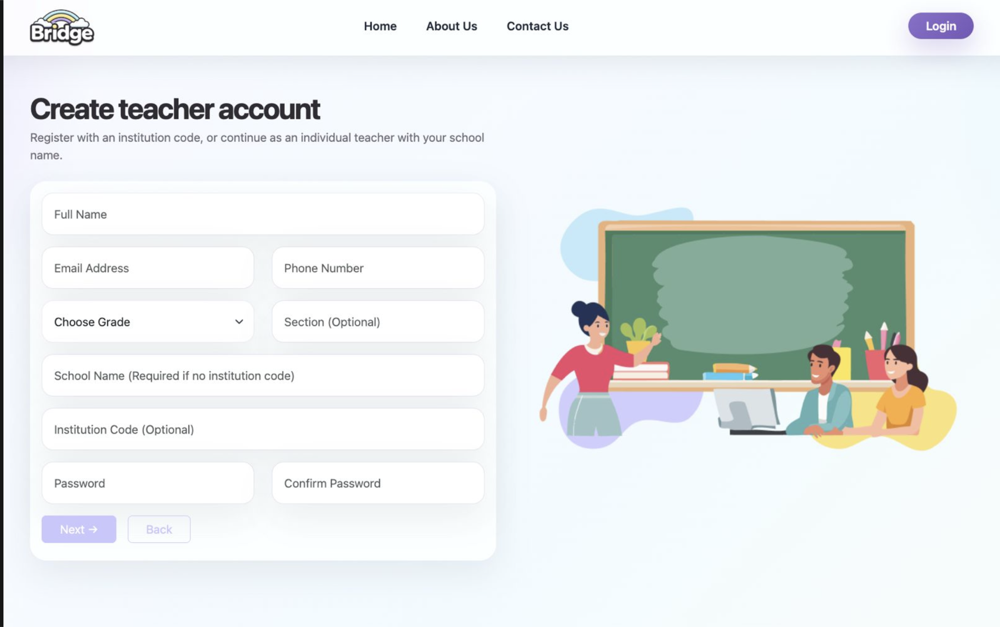
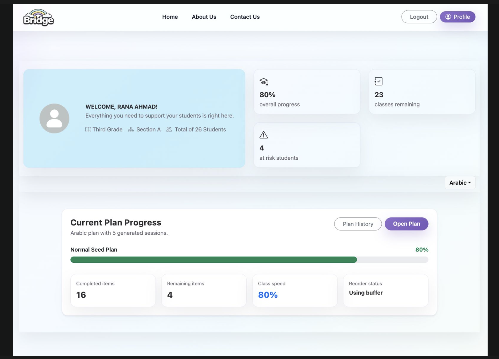
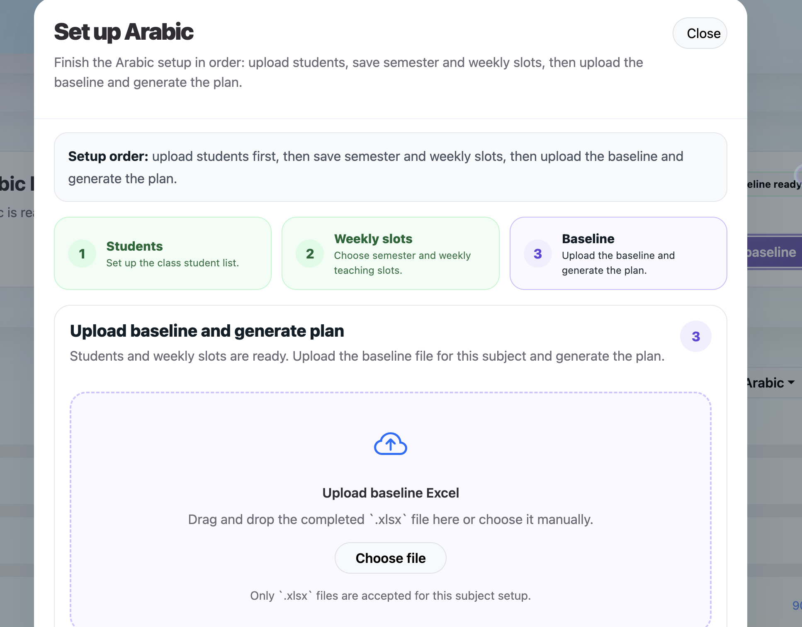

# Bridge

A web application that helps early-grade teachers analyze student performance, generate adaptive learning plans, and track progress.

## Features
- Teacher, parent, and admin roles
- Baseline exam analysis
- Adaptive lesson plan generation
- Progress tracking and dashboards
- Quiz and homework management

## Screenshots

### Teacher Register



### Teacher Dashboard



### Baseline Upload



### Generated Plan


### Parent Dashboard


## Tech Stack

* **Backend:** NestJS, Node.js, TypeScript
* **Authentication:** JWT
* **Database:** SQLite for local/demo development using TypeORM
* **Frontend:** ASP.NET MVC prototype
* **Planned Frontend Rewrite:** React + TypeScript

> Note: The current frontend prototype was implemented using ASP.NET MVC as part of the graduation project team implementation. A React/TypeScript frontend rewrite is planned as a future improvement.

## Environment Variables

Create a `.env` file inside the `BackEnd` folder before running the backend.

Example:

```env
PORT=3000

JWT_SECRET=your_jwt_secret_here

DATABASE_PATH=./database.sqlite

MAIL_HOST=smtp.example.com
MAIL_PORT=587
MAIL_USER=your_email@example.com
MAIL_PASS=your_email_app_password
MAIL_FROM=Bridge <your_email@example.com>
```

Email configuration is required for registration or account verification features that send emails. Do not commit real email credentials or secrets to GitHub.

## How to Run Locally

### Backend

```bash
cd BackEnd
npm install
npm run start:dev
```

### Frontend

Open the ASP.NET MVC solution from:

```bash
Frontend/GP.sln
```

Then run it using Visual Studio.

## Project Status

Bridge is a graduation project prototype. The core backend features and demo flows are implemented, while documentation, deployment setup, and a future React frontend rewrite are planned improvements.
